# NVMeVirt

## Introduction

NVMeVirt is a versatile software-defined virtual NVMe device. It is implemented as a Linux kernel module providing the system with a virtual NVMe device of various kinds. Currently, NVMeVirt supports conventional SSDs, NVM SSDs, ZNS SSDs, etc. The device is emulated at the PCI layer, presenting a native NVMe device to the entire system. Thus, NVMeVirt has the capability not only to function as a standard storage device, but also to be utilized in advanced storage configurations, such as NVMe-oF target offloading, kernel bypassing, and PCI peer-to-peer communication.

Further details on the design and implementation of NVMeVirt can be found in the following papers.
- [NVMeVirt: A Versatile Software-defined Virtual NVMe Device (FAST 2023)](https://www.usenix.org/conference/fast23/presentation/kim-sang-hoon)
- [Empowering Storage Systems Research with NVMeVirt: A Comprehensive NVMe Device Emulator (Transactions on Storage 2023)](https://dl.acm.org/doi/full/10.1145/3625006)

Please feel free to contact us at [nvmevirt@gmail.com](mailto:nvmevirt@gmail.com) if you have any questions or suggestions. Also you can raise an issue anytime for bug reports or discussions.

We encourage you to cite our paper at FAST 2023 as follows:
```
@InProceedings{NVMeVirt:FAST23,
  author = {Sang-Hoon Kim and Jaehoon Shim and Euidong Lee and Seongyeop Jeong and Ilkueon Kang and Jin-Soo Kim},
  title = {{NVMeVirt}: A Versatile Software-defined Virtual {NVMe} Device},
  booktitle = {Proceedings of the 21st USENIX Conference on File and Storage Technologies (USENIX FAST)},
  address = {Santa Clara, CA},
  month = {February},
  year = {2023},
}
```


## Installation

### Linux kernel requirement

The recommended Linux kernel version is v5.15.x and higher (tested on Linux vanilla kernel v5.15.37 and Ubuntu kernel v5.15.0-58-generic).

### Reserving physical memory

A part of the main memory should be reserved for the storage of the emulated NVMe device. To reserve a chunk of physical memory, add the following option to `GRUB_CMDLINE_LINUX` in `/etc/default/grub` as follows:

```bash
GRUB_CMDLINE_LINUX="memmap=64G\\\$128G"
```
从128G的位置开始保留64G的内存用作虚拟设备存储

This example will reserve 64GiB of physical memory chunk (out of the total 192GiB physical memory) starting from the 128GiB memory offset. You may need to adjust those values depending on the available physical memory size and the desired storage capacity.

After changing the `/etc/default/grub` file, you are required to run the following commands to update `grub` and reboot your system.

```bash
$ sudo update-grub
$ sudo reboot
```

### Compiling `nvmevirt`

Please download the latest version of `nvmevirt` from Github:

```bash
$ git clone https://github.com/snu-csl/nvmevirt
```

`nvmevirt` is implemented as a Linux kernel module. Thus, the kernel headers should be installed in the `/lib/modules/$(shell uname -r)` directory to compile `nvmevirt`.

Currently, you need to select the target device type by manually editing the `Kbuild`. You may find the following lines in the `Kbuild`, which imply that NVMeVirt is currently configured for emulating NVM(Non-Volatile Memory) SSD (such as Intel Optane SSD). You may uncomment other one to change the target device type. Note that you can select one device type at a time.

```Makefile
# Select one of the targets to build
CONFIG_NVMEVIRT_NVM := y
#CONFIG_NVMEVIRT_SSD := y
#CONFIG_NVMEVIRT_ZNS := y
#CONFIG_NVMEVIRT_KV := y
```

You may find the detailed configuration parameters for conventional SSD and ZNS SSD from `ssd_config.h`.

Build the kernel module by running the `make` command in the `nvmevirt` source directory.
```bash
$ make
make -C /lib/modules/5.15.37/build M=/path/to/nvmev modules
make[1]: Entering directory '/path/to/linux-5.15.37'
  CC [M]  /path/to/nvmev/main.o
  CC [M]  /path/to/nvmev/pci.o
  CC [M]  /path/to/nvmev/admin.o
  CC [M]  /path/to/nvmev/io.o
  CC [M]  /path/to/nvmev/dma.o
  CC [M]  /path/to/nvmev/simple_ftl.o
  LD [M]  /path/to/nvmev/nvmev.o
  MODPOST /path/to/nvmev/Module.symvers
  CC [M]  /path/to/nvmev/nvmev.mod.o
  LD [M]  /path/to/nvmev/nvmev.ko
  BTF [M] /path/to/nvmev/nvmev.ko
make[1]: Leaving directory '/path/to/linux-5.15.37'
$
```

### Using `nvmevirt`

`nvmevirt` is configured to emulate the NVM SSD by default. You can attach an emulated NVM SSD in your system by loading the `nvmevirt` kernel module as follows:

```bash
$ sudo insmod ./nvmev.ko \
  memmap_start=128G \       # e.g., 1M, 4G, 8T
  memmap_size=64G   \       # e.g., 1M, 4G, 8T
  cpus=7,8                  # List of CPU cores to process I/O requests (should have at least 2)
```

In the above example, `memmap_start` and `memmap_size` indicate the relative offset and the size of the reserved memory, respectively. Those values should match the configurations specified in the `/etc/default/grub` file shown earlier. In addition, the `cpus` option specifies the id of cores on which I/O dispatcher and I/O worker threads run. You have to specify at least two cores for this purpose: one for the I/O dispatcher thread, and one or more cores for the I/O worker thread(s).

It is highly recommended to use the `isolcpus` Linux command-line configuration to avoid schedulers putting tasks on the CPUs that NVMeVirt uses:

```bash
GRUB_CMDLINE_LINUX="memmap=64G\\\$128G isolcpus=7,8"
```

When you are successfully load the `nvmevirt` module, you can see something like these from the system message.

```log
$ sudo dmesg
[  144.812917] nvme nvme0: pci function 0001:10:00.0
[  144.812975] NVMeVirt: Successfully created virtual PCI bus (node 1)
[  144.813911] NVMeVirt: nvmev_proc_io_0 started on cpu 7 (node 1)
[  144.813972] NVMeVirt: Successfully created Virtual NVMe device
[  144.814032] NVMeVirt: nvmev_dispatcher started on cpu 8 (node 1)
[  144.822075] nvme nvme0: 48/0/0 default/read/poll queues
```

If you encounter a kernel panic in `__pci_enable_msix()` or in `nvme_hwmon_init()` during `insmod`, it is because the current implementation of `nvmevirt` is not compatible with IOMMU. In this case, you can either turn off Intel VT-d or IOMMU in BIOS, or disable the interrupt remapping using the grub option as shown below:

```bash
GRUB_CMDLINE_LINUX="memmap=64G\\\$128G intremap=off"
```

Now the emulated `nvmevirt` device is ready to be used as shown below. The actual device number (`/dev/nvme0`) can vary depending on the number of real NVMe devices in your system.


```bash
$ ls -l /dev/nvme*
crw------- 1 root root 242, 0 Feb 22 14:13 /dev/nvme0
brw-rw---- 1 root disk 259, 5 Feb 22 14:13 /dev/nvme0n1
```

## Contributing
When contributing to this repository, please first discuss the change you wish to make via [issues](https://github.com/snu-csl/nvmevirt/issues) or email(nvmevirt@gmail.com) before making a change.

### Pull Requests
1. Create a personal fork of the project on Github.
2. Clone the fork on your local machine.
3. Implement/fix your feature, comment your code.
4. Follow the code style of this project, including indentation.
5. Run tests using [nvmev-evaluation](https://github.com/snu-csl/nvmev-evaluation).
6. From your fork open a pull request in our `main` branch!
7. Please wait for the maintainer's review.


## License

NVMeVirt is offered under the terms of the GNU General Public License version 2 as published by the Free Software Foundation. More information about this license can be found [here](https://www.gnu.org/licenses/old-licenses/gpl-2.0.en.html).

Priority queue implementation [`pqueue/`](pqueue/) is offered under the terms of the BSD 2-clause license (GPL-compatible). (Copyright (c) 2014, Volkan Yazıcı <volkan.yazici@gmail.com>. All rights reserved.)


## testing

### configs
修改编辑/etc/default/grub
```bash
GRUB_CMDLINE_LINUX="memmap=4G\\\6G isolcpus=2,3"

#生效grub
update-grub
#重启
reboot
```

从6G的位置开始保留4G的空间

### 运行NVMeVirt
```bash
sudo insmod ./nvmev.ko memmap_start=6G memmap_size=4G cpus=2,3
```

查看kernel logs
```log
[  326.781688] nvmev: loading out-of-tree module taints kernel.
[  326.781705] nvmev: module verification failed: signature and/or required key missing - tainting kernel
[  326.786150] NVMeVirt: Version 1.10 for >> Samsung 970 Pro SSD <<
[  326.786163] NVMeVirt: Storage: 0x180100000-0x280000000 (4095 MiB)
[  326.796294] NVMeVirt: Total Capacity(GiB,MiB)=1,1024 chs=2 luns=4 lines=8192 blk-size(MiB,KiB)=0,32 line-size(MiB,KiB)=0,128
[  326.808814] NVMeVirt: [chmodel_init] bandwidth 800 max_credits 26 tx_time 152
[  326.825516] NVMeVirt: [chmodel_init] bandwidth 800 max_credits 26 tx_time 152
[  326.825567] NVMeVirt: [chmodel_init] bandwidth 3360 max_credits 110 tx_time 36
[  326.827359] NVMeVirt: pqueue: Copyright (c) 2014, Volkan Yazıcı <volkan.yazici@gmail.com>. All rights reserved.
[  326.827447] NVMeVirt: Init FTL instance with 2 channels (262144 pages)
[  326.837045] NVMeVirt: [chmodel_init] bandwidth 800 max_credits 26 tx_time 152
[  326.851049] NVMeVirt: [chmodel_init] bandwidth 800 max_credits 26 tx_time 152
[  326.851070] NVMeVirt: [chmodel_init] bandwidth 3360 max_credits 110 tx_time 36
[  326.852586] NVMeVirt: Init FTL instance with 2 channels (262144 pages)
[  326.862741] NVMeVirt: [chmodel_init] bandwidth 800 max_credits 26 tx_time 152
[  326.872369] NVMeVirt: [chmodel_init] bandwidth 800 max_credits 26 tx_time 152
[  326.872391] NVMeVirt: [chmodel_init] bandwidth 3360 max_credits 110 tx_time 36
[  326.873937] NVMeVirt: Init FTL instance with 2 channels (262144 pages)
[  326.883591] NVMeVirt: [chmodel_init] bandwidth 800 max_credits 26 tx_time 152
[  326.892983] NVMeVirt: [chmodel_init] bandwidth 800 max_credits 26 tx_time 152
[  326.893025] NVMeVirt: [chmodel_init] bandwidth 3360 max_credits 110 tx_time 36
[  326.897986] NVMeVirt: Init FTL instance with 2 channels (262144 pages)
[  326.898022] NVMeVirt: FTL physical space: 4293918720, logical space: 4013008149 (physical/logical * 100 = 107)
[  326.898024] NVMeVirt: ns 0/1: size 3827 MiB
[  326.899118] PCI host bridge to bus 0001:10
[  326.899128] pci_bus 0001:10: root bus resource [io  0x0000-0xffff]
[  326.899131] pci_bus 0001:10: root bus resource [mem 0x00000000-0x1fffffffffff]
[  326.899135] pci_bus 0001:10: root bus resource [bus 00-ff]
[  326.899153] pci 0001:10:00.0: [0c51:0110] type 00 class 0x010802 PCIe Endpoint
[  326.899159] pci 0001:10:00.0: BAR 0 [mem 0x180000000-0x180003fff 64bit]
[  326.899163] pci 0001:10:00.0: enabling Extended Tags
[  326.911778] NVMeVirt: Virtual PCI bus created (node 0)
[  326.913593] NVMeVirt: nvmev_io_worker_0 started on cpu 3 (node 0)
[  326.915738] NVMeVirt: nvmev_dispatcher started on cpu 2 (node 0)
[  326.916158] nvme nvme1: pci function 0001:10:00.0
[  326.925504] nvme nvme1: 72/0/0 default/read/poll queues
[  326.942828] NVMeVirt: Virtual NVMe device created
```

创建成功

## 代码分析
初始化NVMeV虚拟设备

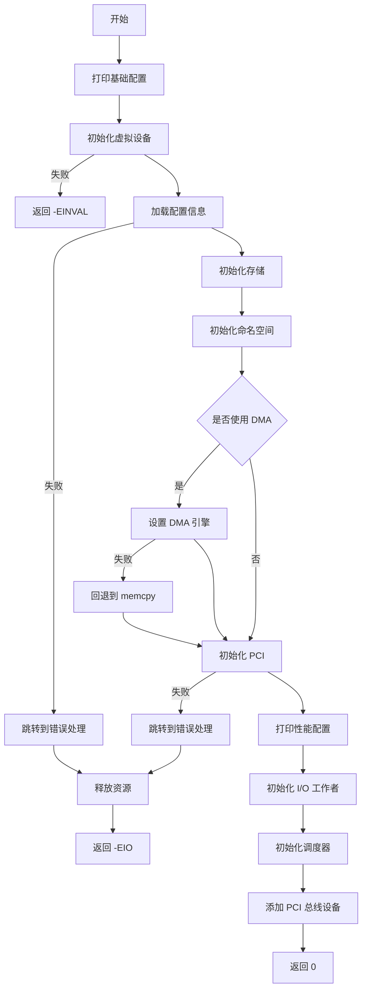


`struct nvmev_dev *VDEV_INIT(void)`函数的流程图如下：
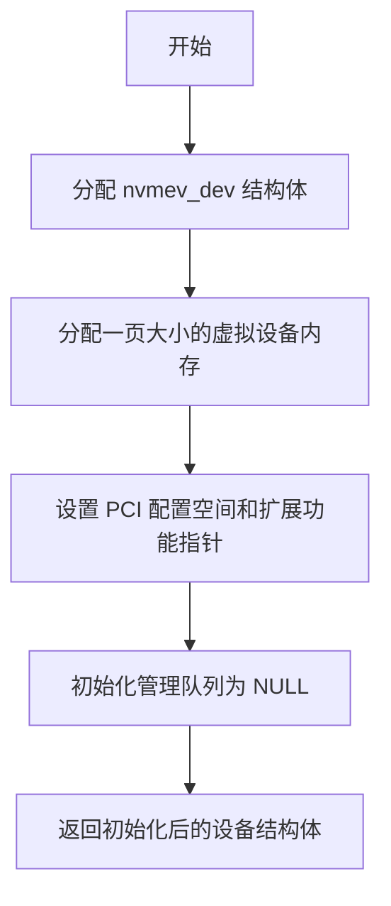
`static bool __load_configs(struct nvmev_config *config)`函数的流程图如下
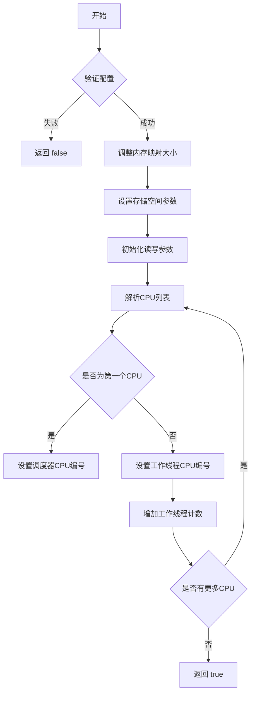
初始化一个NVMe虚拟设备的存储模块
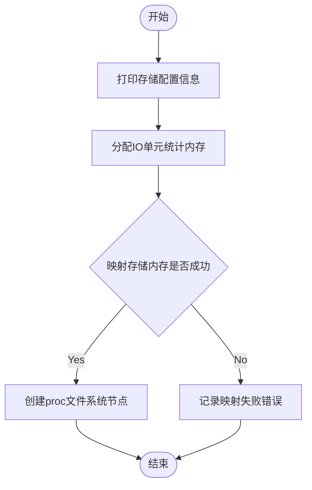

初始化NVMe虚拟设备命名空间 `NVMeV_init` :
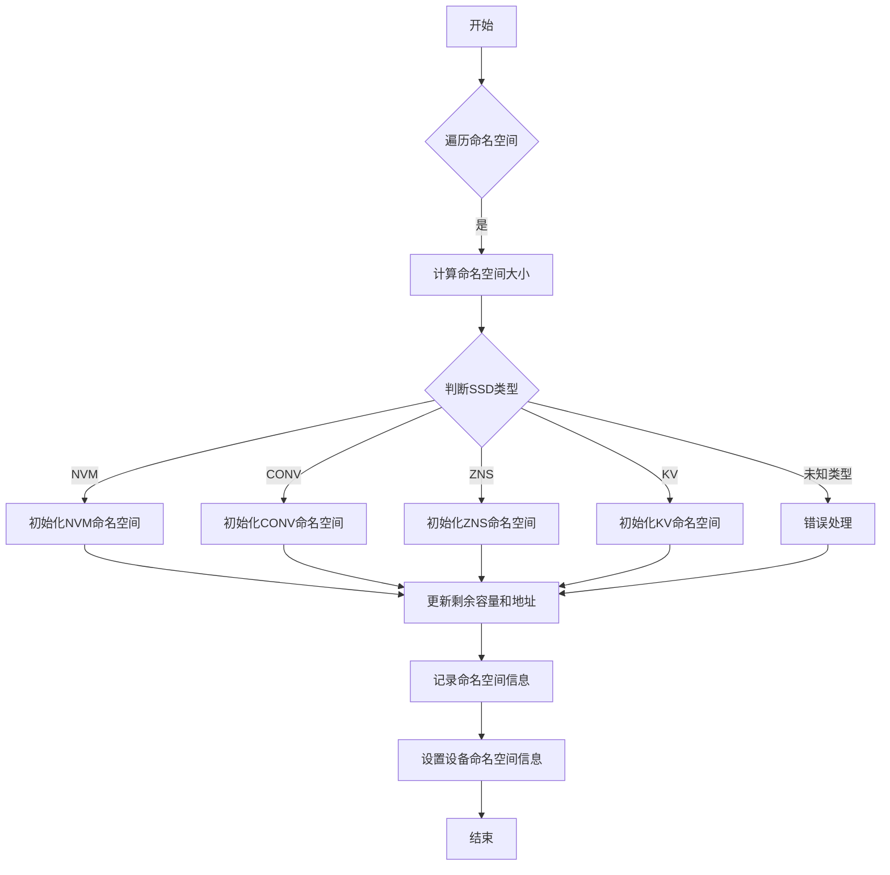

初始化conv命名空间 `conv_init_namespace` :
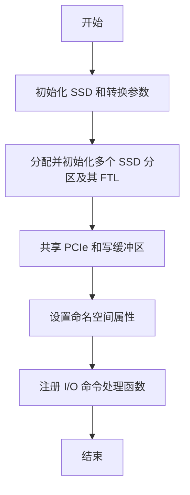

初始化SSD参数 `ssd_init_params` ：
- 设置基本参数如扇区大小、页面大小等。
- 根据通道数和分区数调整通道数和容量。
- 计算块、平面、LUN 和通道的数量及大小。
- 设置读写延迟和其他性能参数。
- 计算总容量和各层级的大小，并输出相关信息。
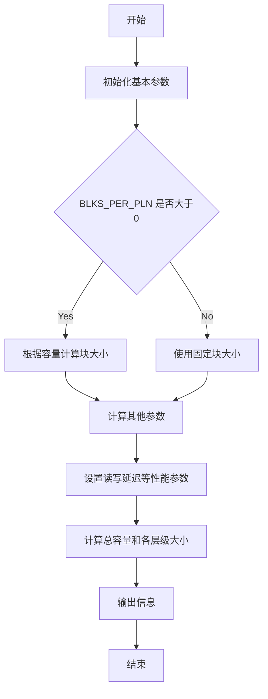
PCIe 写缓存
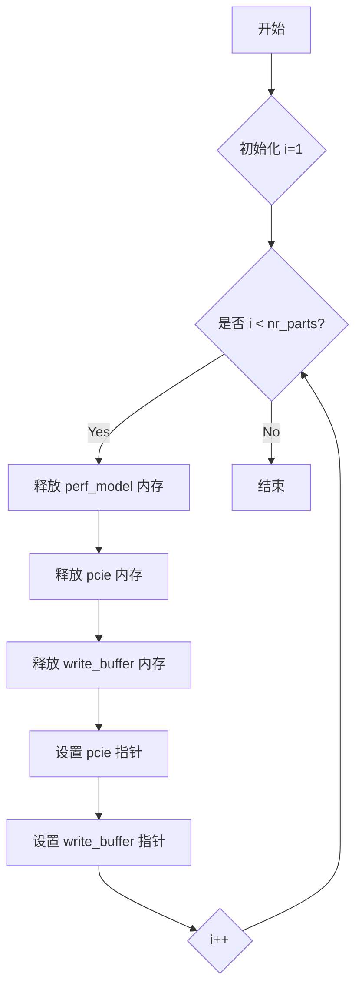


初始化虚拟NVMe设备的IO工作线程
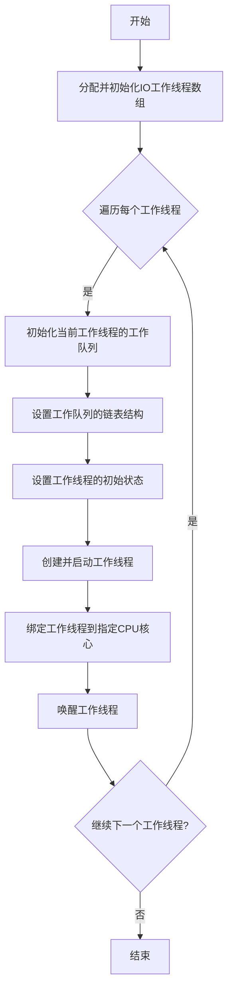
IO工作线程：
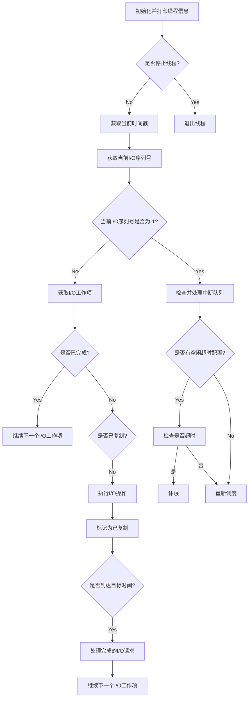

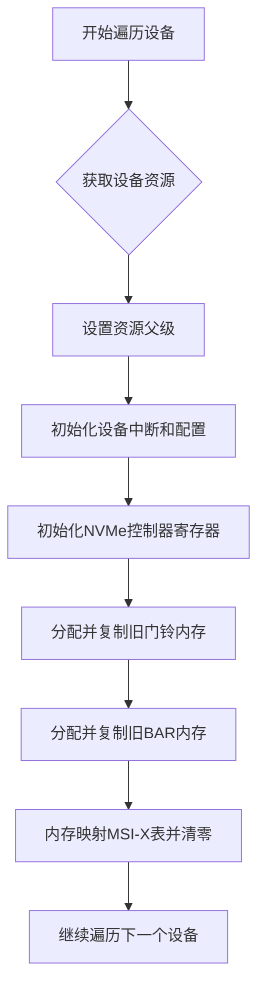

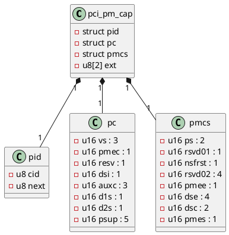